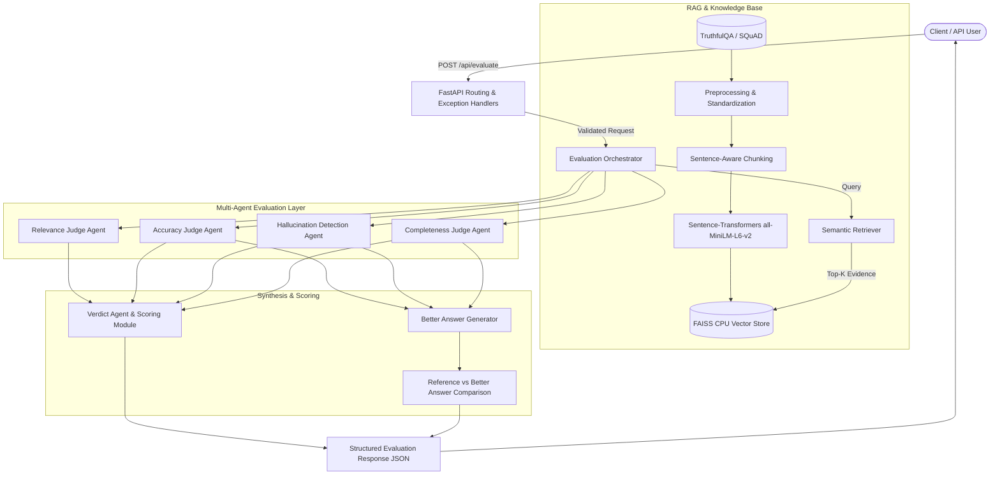

# System Architecture — AI Response Validation System

This document outlines the architectural design, component interactions, and execution flow of the **AI Response Validation System with Hallucination Detection Assistance** (Milestone 1).

---

## 1. High-Level Architecture Overview

The system is engineered as a modular, decoupled evaluation platform composed of four core layers:
1. **API & Validation Layer**: REST endpoints, Pydantic request parsing, and centralized error handling.
2. **Retrieval-Augmented Generation (RAG) & Knowledge Base Layer**: Dataset ingestion, preprocessing, chunking, embedding generation, FAISS indexing, and semantic retrieval.
3. **Multi-Agent Evaluation Layer**: Modular judge agents (Relevance, Accuracy, Hallucination Detection, Completeness) coordinated by an Orchestrator.
4. **Synthesis & Scoring Layer**: Grounded "Better Answer" generation, composite scoring, verdict determination, and visualization comparison metrics.



---

## 2. Logical Components Breakdown

The system implements the 20 logical architectural components:

| # | Component | Module | Responsibility |
|---|---|---|---|
| 1 | **Evaluation API Layer** | `backend/api/routes/evaluation.py` | Exposes REST endpoints (`POST /api/evaluate`, `GET /api/retrieval`). |
| 2 | **Input Processing** | `backend/api/schemas/evaluation.py` | Normalizes incoming JSON payloads into typed Pydantic models. |
| 3 | **Input Validation** | `backend/main.py` + `schemas` | Strict validation enforcing non-empty questions, references, and responses. |
| 4 | **Reference Knowledge Base** | `data/processed/vector_index.faiss` | Persisted index of verified benchmark knowledge. |
| 5 | **Benchmark Ingestion** | `backend/knowledge_base/ingestion.py` | Pipeline for ingesting TruthfulQA and SQuAD benchmarks. |
| 6 | **Data Cleaning & Standardization**| `backend/knowledge_base/preprocessing.py`| Normalizes records into uniform `KBRecord` structures. |
| 7 | **Chunking** | `backend/knowledge_base/chunking.py` | Sentence-aware sliding-window chunker with context overlap. |
| 8 | **Embedding Generation** | `backend/retrieval/embeddings.py` | Singleton SentenceTransformer wrapper with CPU vector normalization. |
| 9 | **Vector Store / Search** | `backend/retrieval/vector_store.py` | FAISS `IndexFlatIP` storing normalized embeddings with metadata. |
| 10 | **RAG Retrieval Pipeline** | `backend/retrieval/retriever.py` | Independent retrieval interface: `retrieve_relevant_context(question, top_k)`. |
| 11 | **Source Evidence Retrieval** | `backend/retrieval/retriever.py` | Matches query intent with ground-truth chunks and user documents. |
| 12 | **LLM Evaluation Layer** | `backend/services/llm_service.py` | Abstract `BaseLLMClient` supporting OpenAI, Gemini, and Local Semantic Judge. |
| 13 | **Evaluation Orchestrator** | `backend/agents/orchestrator.py` | Coordinates multi-agent pipeline and aggregates results. |
| 14 | **Relevance Judge Agent** | `backend/agents/relevance_agent.py` | Measures question-answer topical alignment and interrogative intent. |
| 15 | **Accuracy Judge Agent** | `backend/agents/accuracy_agent.py` | Compares claims against ground truth, flags factual contradictions. |
| 16 | **Hallucination Detection Agent** | `backend/agents/hallucination_agent.py`| Performs claim-level grounding verification and risk quantification. |
| 17 | **Completeness Judge Agent** | `backend/agents/completeness_agent.py` | Evaluates coverage of key reference concepts and notes omissions. |
| 18 | **Verdict Agent** | `backend/agents/verdict_agent.py` | Synthesizes weighted composite score, assigns verdict label, gives recommendation. |
| 19 | **Scoring Module** | `backend/evaluation/scoring.py` | Normalization, risk tiering, weighting, and verdict thresholds. |
| 20 | **Structured Result Module** | `backend/api/schemas/evaluation.py` | Assembles consistent, frontend-friendly JSON response. |

---

## 3. Request-Response Lifecycle

1. **Submission**: Client posts a JSON body with `question`, `ai_response`, `reference_answer`, and optional `source_document`.
2. **Validation**: Pydantic validates non-empty strings and bounds. If any required field is missing or whitespace, a structured 422 JSON error is returned immediately:
   ```json
   {
     "error": "Question is required",
     "message": "Please enter the question before submitting the evaluation."
   }
   ```
3. **Retrieval**: Orchestrator queries FAISS vector store for top-k relevant benchmark chunks matching the question.
4. **Agent Execution**:
   - **Similarity**: Embedding cosine similarity is computed between AI response and reference answer.
   - **Relevance Judge**: Assesses intent and topic coverage.
   - **Accuracy Judge**: Checks for factual discrepancies, negated claims, and numeric mismatches.
   - **Hallucination Detection Agent**: Extracts individual claims, checks each against evidence, identifies unsupported or contradictory claims, and calculates hallucination risk percentage.
   - **Completeness Judge**: Assesses information recall and flags missing concepts.
5. **Synthesis**:
   - If flaws exist (accuracy < 85, hallucination > 15%, or completeness < 80), a grounded **Better Answer** is synthesized from reference material.
   - Comparison metrics (reference score, better answer score, similarity) are calculated.
6. **Verdict**: Verdict Agent calculates weighted overall score and assigns label ("Excellent", "Good", "Needs Improvement", "Poor").
7. **Response**: Final structured JSON response returned with 200 OK.
